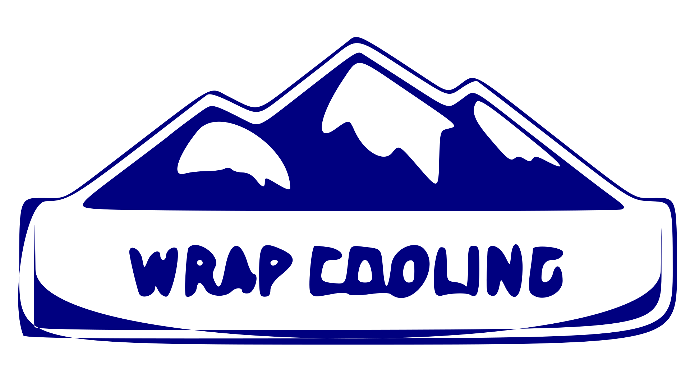

# StirUp

This project presents the development and implementation of a recipe generator web application aimed at providing personalized cooking recommendations based on user preferences and available ingredients


## Tech Stack

**Client:** React, TailwindCSS

**Server:** Node, Express


## Run Locally

Clone the project

```bash
  git clone https://github.com/TarunTechie/Warp_cooling.git
```

Go to the project directory

### To run the frontend
```bash
  cd frontend
```

Install dependencies

```bash
  npm install
```

Start the server

```bash
  npm run dev
```

### To run the backend
```bash
  cd backend
```

Install dependencies

```bash
  npm install
```

Start the server

```bash
  npm run dev
```
